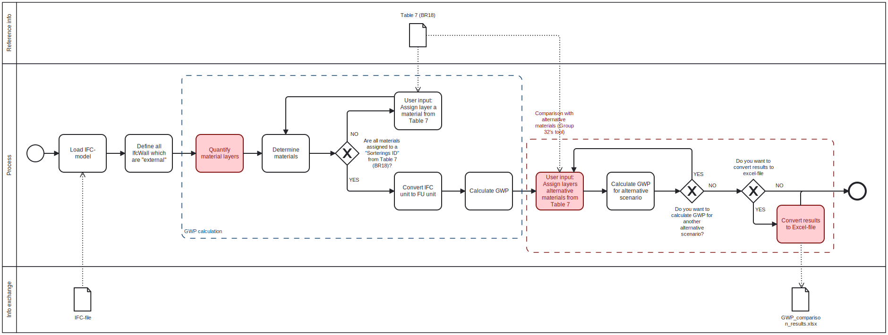

# A3
Hi, and welcome to the description of our tool!

In the sections below, you will be guided through the development and reasoning for our tool, a detailed step-by-step guide on how to use our tool, and finally how it is related to Advanced Building Design. 

## About our tool

This tool links the geometric data of external walls extracted from IFC files with generic Environmental Product Declaration (EPD) data provided in Table 7 of BR18. It calculates the Global Warming Potential (GWP) for various user-defined wall materials, enabling architects and engineers to easily compare multiple building design options in terms of their environmental impact.

We developed the tool, as we found calculating the GWP was non-automatic and time-consuming in the Danish software _LCAbyg_. Therefore, our tool optimize this problem by making the process of comparing different scenarios easier, faster, and more organized. 

In other words, the tool is not only a calculation tool, but also a comparison tool that supports better and more sustainable design decisions. If the tool was to be developed furter, all the rest of the building components were to be included for GWP calculations and comparison. 

----

The IFC test file used under the development of the tool, is _25-16-D-ARCH_, computed by Group 16 during the DTU course Advanced Building Design in the spring 2025, and the appertaining report _25_16_D_MAT_. 

As the tool is a GWP comparison tool only suitable for generic EPD's, a specific problem from the report have not been identified. Instead, the report have been used as a basis for the comparison idea, as the report states different GWP values for different materials. These materials are, unfortunately, connected to product specific EPD's, and therefore, it has not been possible to state the report's claim. 

----
## Description of our tool

Our tool is divided into several smaller Python scripts to make future changes or updates easier.

- Model.py – reads and organizes data from the BIM model.
- Defining_Exterior_Walls.py – selects the exterior walls to be analysed.
- Calculate_Wall_Layer_Volumes.py – calculates the volume and thickness of each wall layer.
- Conversion_factor.py – handles unit and mass conversions.
- GWP_calculation.py – performs the Global Warming Potential (GWP) calculation.
- GWP_comparison.py - calculate GWP for different materials and compare.
- Tabel_7_materials_assigned.py – connects the materials from the BIM model with the EPD data in the Excel file.

**TABLE 7 of BR18**

_Tabel-7-2025_ is integrated into the tool. Table 7 in BR18 provides standardized Global Warming Potential (GWP) values for common building materials and is used in the life cycle assessment (LCA) calculations required by BR18.
To run the tool, the user must have the corresponding Excel file open.

----
**SPØRG OM MAIN.PY**

**Instructions to run the tool**

To run the GWP comparison tool, please follow the instructions listed below:

1. Download the Python scripts (7 files in total)  and _Tabel-7-2025.xlsx_. Be sure to save all files in the same folder.
2. Run the _GWP_comparison.py_ file

The script uses input from you (the user), and what you have to input will now be described:

3. Choose your IFC file
     - The script will automatically open a folder on your folder, where you can navigate to your IFC file)
5. Choose the External wall, for which you want to calculate GWP
6. Choose the specific _"Sorterings ID"_ related to the EPD(s) you want to map to your External wall's material layer(s)
     - Do this as many times as you have material layers and the script will calculte the GWP 
7. NOTE: the tool is only compatible for specific pre-defined units, which are suitable for wall materials, meaning that if you choose a _"Sorterings ID"_ related to one of these non-compatible units, you will be asked to choose a new _"Sorterings ID"_

As you asses the GWP for your chosen materials, you will be asked if you want to compare different materials' GWP (you can do this as many times as you want): 

8. Choose between _"y"_ (yes) or _"n"_ (no)
9. If _no_, thank you for trying our tool
10. If _yes_, choose the specific _"Sorterings ID"_ related to the EPD(s) you want to map to your External wall's material layer(s)
    - Do this as many times as you have material layers and the script will calculte the GWP
11. Choose if you want to export your results to Excel

The tool ends here - thank you for trying it out!

If you are intrested, the flowchart for our tool is illustrated in the figure below: 

**Updated BPMN-diagram**

## Advanced Building Design

_What Advanced Building Design Stage (A,B,C or D) would your tool be usefuL?_

Our tool would be useful in stage C (Detailed Design / Environmental Analysis). 
At this stage, we have decided on the main materials and can check their environmental impact using this tool.

However, the tool would also be useful in stage D, as it simply can assist in calculating the final GWP. 

_Which subjects might use it?_

Since the tool is developed for GWP comparison for building components, it could be used in any subject, where calculating the GWP is relevant. This could be a Life Cycle Assessment (LCA) course with focus on buildings, or the Advanced Building Design course - especially, suitable for the [Role of Material consultant](https://timmcginley.github.io/41936/Subjects/Materials/index.html). 

_What information is required in the model for your tool to work?_

The tool is dependent on the listed different quantities, material names and more defined in the IFC model: 

- External walls
- Wall layer(s)
- Material names assigned to the different material layer(s)
- Volumes and thickness for each layer

- Table 7 of BR18 (not implemented in the model, but necessary for the tool to work)

---
### 04 IDS

---
